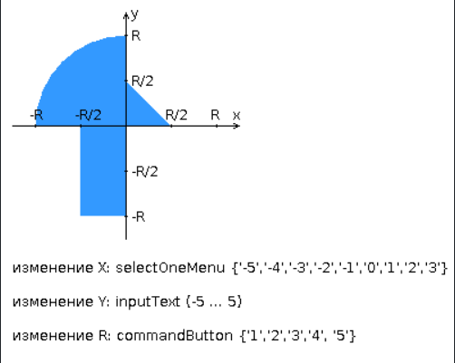

# Лабораторная работа №3
## Вараинт 469236
Разработать приложение на базе JavaServer Faces Framework, которое осуществляет проверку попадания точки в заданную область на координатной плоскости.

Приложение должно включать в себя 2 facelets-шаблона - стартовую страницу и основную страницу приложения, а также набор управляемых бинов (managed beans), реализующих логику на стороне сервера.

Стартовая страница должна содержать следующие элементы:
- "Шапку", содержащую ФИО студента, номер группы и номер варианта.
- Интерактивные часы, показывающие текущие дату и время, обновляющиеся раз в 8 секунд.
- Ссылку, позволяющую перейти на основную страницу приложения.

Основная страница приложения должна содержать следующие элементы:
- Набор компонентов для задания координат точки и радиуса области в соответствии с вариантом задания. Может потребоваться использование дополнительных библиотек компонентов - ICEfaces (префикс "ace") и PrimeFaces (префикс "p"). Если компонент допускает ввод заведомо некорректных данных (таких, например, как буквы в координатах точки или отрицательный радиус), то приложение должно осуществлять их валидацию.
- Динамически обновляемую картинку, изображающую область на координатной плоскости в соответствии с номером варианта и точки, координаты которых были заданы пользователем. Клик по картинке должен инициировать сценарий, осуществляющий определение координат новой точки и отправку их на сервер для проверки её попадания в область. Цвет точек должен зависить от факта попадания / непопадания в область. Смена радиуса также должна инициировать перерисовку картинки.
- Таблицу со списком результатов предыдущих проверок.
- Ссылку, позволяющую вернуться на стартовую страницу.

Дополнительные требования к приложению:
- Все результаты проверки должны сохраняться в базе данных под управлением СУБД PostgreSQL.
- Для доступа к БД необходимо использовать ORM Hibernate.
- Для управления списком результатов должен использоваться Application-scoped Managed Bean.
- Конфигурация управляемых бинов должна быть задана с помощью аннотаций.
- Правила навигации между страницами приложения должны быть заданы в отдельном конфигурационном файле.




## Как запустить?
- Придётся использовать Java 11 (ура лаба по легаси)
### Для запуска локально (легче было сразу в докере делать, но ладно):
- Скачиваем "WildFly 20.0.0 Final" с https://www.wildfly.org
- Создаём пользователя для админки: ```.\wildfly-20.0.0.Final\bin\add-user.bat```
- Добавляем Datasource для PostgreSQL:
  - Открываем ```wildfly-20.0.0.Final\standalone\configuration\standalone.xml```
  - Ищем ```<datasources>```
  - Меняем параметр jndi-name на ```java:/jboss/datasources/PostgreDS```
  - Меняем параметр pool-name на ```PostgreDS```
  - параметр statistics-enabled убираем
  - В секции ```<driver>``` указываем имя драйвера ```postgresql```
  - В секции ```<connection-url>``` указываем URL вашей базы данных, например ```jdbc:postgresql://localhost:5432/studs```
  - В секции ```<user-name>``` указываем пользователя вашей базы данных
  - В секции ```<password>``` указываем пароль пользователя вашей базы данных
  - В секции ```<drivers>``` добавляем драйвер PostgreSQL:
    ```xml                    
    <driver name="postgresql" module="org.postgresql">
    <driver-class>org.postgresql.Driver</driver-class>
    </driver>
    ```
  - В ```<default-bindings>``` также меняем datasource на ```"java:jboss/datasources/PostgreDS"```
  - Копируем postgresql-42.7.7.jar из скачанного с помощью maven в ```wildfly-20.0.0.Final\modules\org\postgresql\main```
  - Создаём в той же директории файл module.xml со следующим содержимым:
  ```xml
  <?xml version="1.0" encoding="UTF-8"?>
  <module xmlns="urn:jboss:module:1.5" name="org.postgresql">
    <resources>
      <resource-root path="postgresql-42.7.7.jar"/>
    </resources>
    <dependencies>
      <module name="javax.api"/>
      <module name="javax.transaction.api"/>
    </dependencies>
  </module>
  ```
- Теперь используем базу данных PostgreSQL с курса программирования прошлого семестра (вы же поднимали её локально там, да?)
- Собираем проект ```mvn clean package```
- Запускаем сервер: ```.\wildfly-20.0.0.Final\bin\standalone.bat```
- Подключаемся к http://localhost:9990
- Открываем вкладку Deployments -> Add -> Select a deployment -> выбираем ```.\target\lab3.war```
- Заходим на http://localhost:8080/lab3

### Для запуска в Docker:
- Собираем Docker образ: ```docker-compose up --build```
- Заходим на http://localhost:8080/lab3

### Для запуска на helios:
- Грузим WildFly на гелиос ```scp -P 2222 wildfly-20.0.0.Final.zip s466217@se.ifmo.ru:/home/studs/s466217/web/lab3/```
- Распаковываем ```unzip wildfly-20.0.0.Final.zip```
- Создаём пользователя для админки: ```sh ./wildfly-20.0.0.Final/bin/add-user.sh```
- Меняем в wildfly-20.0.0.Final\standalone\configuration\standalone.xml все 127.0.0.1 на 0.0.0.0
- Добавляем Datasource для PostgreSQL (см. выше):
  - В секции ```<connection-url>``` указываем URL ```jdbc:postgresql://pg/studs```
  - В секции ```<user-name>``` указываем sXXXXXX
  - В секции ```<password>``` указываем пароль из `.pgpass`
- Меняем в конце файла standalone.xml все порты, кроме последнего на свои
- Указываем другую версию джавы на гелиосе ```JAVA_VERSION=11```
- Запускаем сервер: ```sh ./wildfly-20.0.0.Final/bin/standalone.sh```
- Пробрасываем два порта на гелиос: http и http-management (их мы в standalone.xml указывали)
- Собираем проект: ```mvn clean package```
- Заходим на http://localhost:{http-management}
- Открываем вкладку Deployments -> Add -> Select a deployment -> выбираем ```.\target\lab3.war```
- Заходим на http://localhost:{http}/lab3
